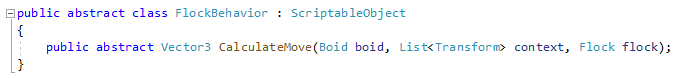
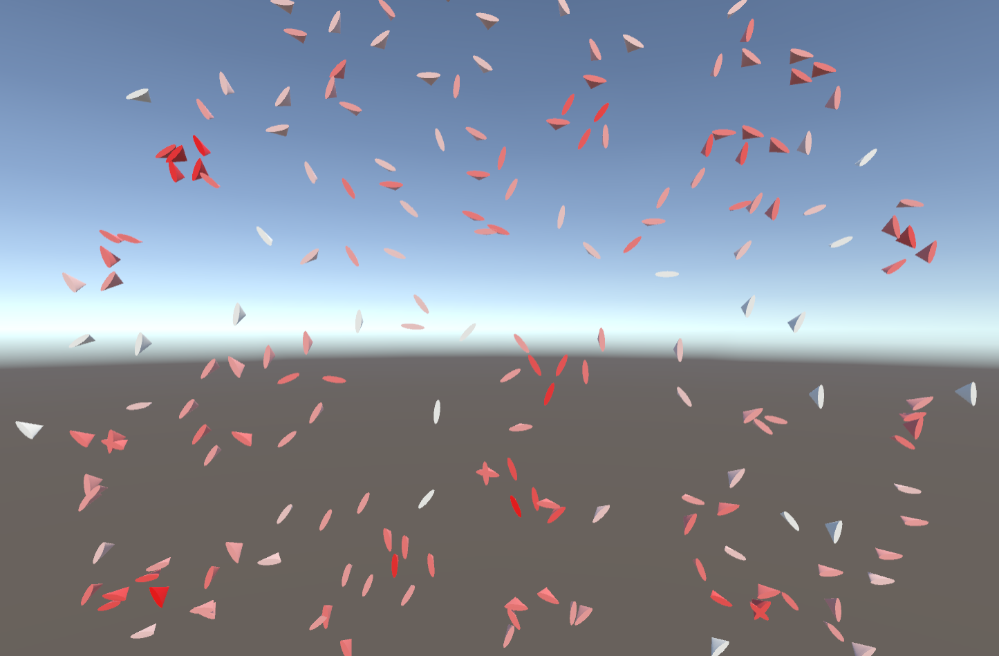
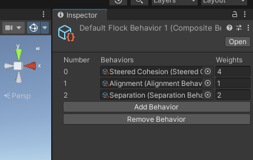

# MENTORING3

## Creative coding with Unity

#### September 2022
### My first mentorship at the HSLU
Hi, I'm a student of the HSLU and study IT and Design. On this site I will document the progress of my mentorship in the semester of fall 2022, in which I'm exploring how to use unity for creative or generative coding. In a discussion with my mentor Guillaume Massol I decided on four goals:

1. Get familiar with Unity and Github
2. Challenge yourself with little projects
3. Get faster with coding
4. Document the process on Github  

#### October 2022
### Getting started
For this project I wanted to do version control with GitHub and use GitHub pages with a Jekyll theme to show the documentation. I have to mention here, that I'm not familiar with both of them. When I started a month ago, I thought, that this would be simple. Guess what? It wasn't! I'm new to Unity, GitHub and Jekyll and I got the impression, that there are a thousend ways to get the three of them working together. And belive me, I wrecked them all! I tried to set it up with Git Bash, cmd, Git Desktop and GitHub remote. I used many diffrent versions of gemfiles, .gitignores and tried out a bunch of Jekyll themes. Sometimes I was angry and desperate and often deleted the whole thing just to restart again. But here I am, the page is up and working and I'm finally ready to go. Whoop, whoop!  

### Research
Before taking action myself I wanted to dig deeper into what creative coding actually is. I found an informative page, that shows many examples of what creative software can do.  
[THE POSSIBILITIES OF CREATIVE CODING](https://eindhoven.makerfaire.com/wp-content/uploads/sites/174/2020/08/Possibilities-of-Creative-Coding.pdf)

After a good talk with Dragica Kahlina, a lecturer at the HSLU, I decided to challenge myself with building an AI that simulates a flock of birds. Therefore I researched the rules of a flock as they were phrased by Craig Reynolds, an artificial life and computer graphics expert. Here is, how an early implementation (1986) from C. Rynolds worked:  
[Craig Reynolds - Original 1986 Boids simulation](https://www.youtube.com/watch?v=86iQiV3-3IA)  

### First flock in p5.js
Because I don't really know how Unity works and I can't programm in C# I thought, it would be good to first write a little prototype in p5.js. To begin with it, I took the example from Daniel Shiffman from The Coding Train in his Coding challenge #124: Flocking Simulation.  
[Coding Challange #124: Flocking Simulation](https://www.youtube.com/watch?v=mhjuuHl6qHM)

My attempt:

<iframe src="content\FLOCK1\01_Flocking_p5\index.html" width="100%" height="450" frameborder="no"></iframe>
 [Full screen](content/FLOCK1/01_Flocking_p5) 

As you can see, the balance for the flocking behavior is very fragile. An other issue is, that performance in p5.js for this kind of project is very limited and so i hoped, that Unity would do better.  

#### November
### Flock in Unity
Now I felt, I was ready to tackle Unity. But my feeling was terribly wrong! I had issues over and over. I managed to let the boids (members of a flock) spawn and at least one had a flight course, but there I was stuck.
<video width="480" height="320" controls="controls">
  <source src="content\FLOCK1\02_Flock1.mp4" type="video/mp4">
</video>  

#### December
### New attempt with scriptable objects
Because of too many problems that weren't solvable for me, I decided not to try to implement a p5.js code in Unity anymore. So I searched for a better idea and found one.  
[Flocking Algorithm in Unity](https://www.youtube.com/playlist?list=PL5KbKbJ6Gf99UlyIqzV1UpOzseyRn5H1d)  
In the tutorial from Board To Bits Games Ben shows, how a flock can be realized in a modular way in Unity. Therefore he uses scriptable objects. I heard of them before and was happy to give these a shot. The tutorial project is build in 2D, but I wanted to do it in 3D, so I had to do minor adjustments.  

### Creating boids
To create the flock I wrote a class Boid that takes a vector to move to the next position. In the class Flock are all the boids handled and every element of the boids behavior will inherit from the scriptable object FlockBehavior. 

When implementing the three rules of a flock every boid has to know about its neighbors. Therefore the flock class submits a list of nearby neightbor transforms to it. As a result we can see, that every boid is aware of its neightbors. In the picture the boids color turns more red the more of them it has.

### The three rules
To get a flock like behavior, I needed to implement three rules that every boid follows. These rules are called cohesion, separation and alignment.
<video width="100%" height="100%" controls="controls">
  <source src="content\FLOCK2\03_Cohesion.mp4" type="video/mp4">
</video>
In cohesion the boid tends to move to the middle of its neightbors.

<video width="100%" height="100%" controls="controls">
  <source src="content\FLOCK2\04_Avoidance.mp4" type="video/mp4">
</video>
For the separation every boid avoids to be to near to any of its neighbors.

<video width="100%" height="100%" controls="controls">
  <source src="content\FLOCK2\05_ AllRules.mp4" type="video/mp4">
</video>
And for alignment the boids tend to align their flight direction with that of their neighbors. When all rules are applied we allready have some kind of flock.  

### Custom editor
To be able to combine all elements of a boids behavior as simple as possible, I needed to write a custom editor for the inspector in Unity. Luckily the tutorial of Boards To Bits Games provided a video of how to do that. Unlucky was, that it doesn't work anymore on the newest versions of Unity. So I had to find a work around. In the end it looks like this:

Now it is easy to just add new elements to the flock create diffrent customized behaviors.  

### More than one flock
What, if you would like to have more than one flock in the same area? For example one with red parrots and one with blue ones? To realize that every boid needs to know to which flock it belongs and to filter which of the neighbors are relevant. Here is how it looks like:
<video width="100%" height="100%" controls="controls">
  <source src="content\FLOCK2\08_a_TwoFlocks.mp4" type="video/mp4">
</video>  

### Avoid obstacles
In a game level you usually want, that a flock doesn't fly right through trees or any sort of that. So our flock needs to respect obstacles. To achieve this I used another filter, that sorts all objects out, that belong to a certain layer. In the video the orange flock avoids the obstacles, whilst the blue one doesn't.
<video width="100%" height="100%" controls="controls">
  <source src="content\FLOCK2\08_AvoidObstacles.mp4" type="video/mp4">
</video>  

### Flock
After taking care that the boids fly head first, I was quite happy with the result. There are still some issues like boids trembling when they adjust their way or boids passing through objects, when they haven't enough space to avoid them because of their neighbors. But I think all over it works pretty well.
<video width="100%" height="100%" controls="controls">
  <source src="content\FLOCK2\11_HeadFirst.mp4" type="video/mp4">
</video>  

### In the game
Now I just needed to put a flock into the level of a game. But as always it isn't as easy as thought. I found, that the birds didn't spawn, where I wanted them to be.
<video width="100%" height="100%" controls="controls">
  <source src="content\FLOCK2\12_SpawnPosition.mp4" type="video/mp4">
</video>

Where are they? – There are they!
<video width="100%" height="100%" controls="controls">
  <source src="content\FLOCK2\13_FlockInGame.mp4" type="video/mp4">
</video>

Finally I was able to let them spawn where they should. Looks cool, doesn't it?
<video width="100%" height="100%" controls="controls">
  <source src="content\FLOCK2\14_MosquitoSwarm.mp4" type="video/mp4">
</video>

If you add a wobble factor as a behavior object, you get some kind of mosquito swarm above a lake.

#### January
### Summary
Finally it's the end of the semester and because of that it is also the end of my mentorship. Now it's time to look back.
In the beginning there were my four goals:  

1. Get familiar with Unity and Github
2. Challenge yourself with little projects
3. Get faster with coding
4. Document the process on Github
  
I was exited about the thought of: "I'm gonna get so much creative code done and achive real cool stuff!" Well, I did. It just wasn't as much as I thought it would be.
Most of the time was used for goal 1 "Get familiar with Unity and Github" and goal 2 "Document the process on Github". It took me ages to figure out how to set up a Github repo in combination with Unity for the code and Jekyll for the documentation on the Github webpage.  
In the end I could challenge myself only with the implementation of a flock. Because I thought it would be possible to create a prototype in p5.js and adapt that piece of code for Unity I wasted much of the time on this attempt. Lesson learned: Don't do that! It isn't like adapting code for example from java to java script. If you want something to happen in Unity, implement it there from the beginning!  
In the process of trial an error I noticed for myself that I in fact got faster at coding. So I think I achived that goal.  
All in all a huge deal of the time I invested for the project I was failing and it was frustrating. But in the end I am mostly proud that I could get the flock to work fine.  
Finally I want to thank Dragica Kahlina for giving me lots of inspiration and helping me to decide on implementing a flock and my mentor Guillaume Massol for discussing the progress from time to time and helping with planning further work.  

I hope you enjoyed reading about my mentorship. If you ever have the chance to get one yourself, I can only recommend it to you. Even though it is sometimes hard to work just by yourself, you will learn a ton by that. So just give it a shot!
